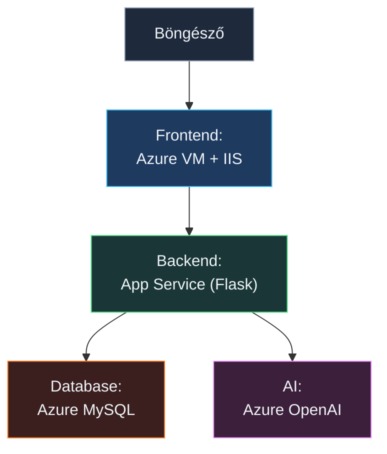

# ☁️ Azure Képzés – Cloud Idézetek + AI Chatbot

Egy napos, gyakorlati Azure képzés. A nap végére egy **működő webalkalmazást** hozunk létre,
ami idézeteket jelenít meg adatbázisból és egy AI chatbotot is tartalmaz.

---

## 🏗️ Architektúra



| Réteg     | Azure szolgáltatás        | Mappa                       |
| --------- | ------------------------- | --------------------------- |
| Frontend  | Azure VM + IIS (Windows)  | `01-Frontend/`              |
| Backend   | App Service (Python)      | `02-Backend/`               |
| Adatbázis | Azure Database for MySQL  | `03-Database/`              |
| AI        | Azure OpenAI / AI Foundry | _(konzolban konfiguráljuk)_ |

---

## 📁 Projekt struktúra

```
.
├── 01-Frontend/
│   ├── index.html
│   ├── css/
│   │   └── style.css
│   └── js/
│       ├── config.js     ← ⚠️ BACKEND_URL beállítás
│       └── app.js
├── 02-Backend/
│   ├── app.py            ← Flask API
│   └── requirements.txt
├── 03-Database/
│   └── init.sql          ← Tábla + idézetek
├── LICENSE
├── README.md             ← Ez a fájl
├── requirements.txt
└── setup-iis.ps1         ← IIS telepítő script
```

---

## 🎯 Haladási terv

| #   | Lépés                                        | Működik utána?            |
| --- | -------------------------------------------- | ------------------------- |
| 1   | Azure VM + IIS + frontend feltöltés          | ❌ (nincs backend URL)    |
| 2   | App Service létrehozása + GitHub deploy      | ❌ (nincs DB, nincs AI)   |
| 3   | config.js frissítése az App Service URL-jére | ❌ (nincs DB)             |
| 4   | Azure MySQL + init.sql + env vars            | ✅ Idézetek működnek!     |
| 5   | Azure OpenAI deployment + env vars           | ✅ AI chatbot is működik! |

---

## Előfeltételek

- Azure előfizetés (ingyenes trial elég)
- GitHub fiók (a backend auto-deployhoz)
- Régió mindenhova: **Sweden Central**
- **DBeaver Community** (adatbázis kezeléshez) – https://dbeaver.io/download/

---

## 1. lépés – Resource Group

Azure Portal → **Resource groups** → **Létrehozás**

| Beállítás | Érték            |
| --------- | ---------------- |
| Name      | `workshop-rg`    |
| Region    | `Sweden Central` |

> 💡 Az összes erőforrást ide rakjuk – a végén egyetlen törlésssel mindent eltávolítunk.

---

## 2. lépés – Azure VM + IIS (Frontend)

> 📂 Fájlok: `01-Frontend/`

### 2.1 VM létrehozása

Azure Portal → **Virtual machines** → **Létrehozás** → **Azure virtual machine**

| Beállítás         | Érték                                         |
| ----------------- | --------------------------------------------- |
| Erőforrás csoport | `workshop-rg`                                 |
| Név               | `frontend-vm`                                 |
| Régió             | `Sweden Central`                              |
| Kép               | **Windows Server 2022 Datacenter**            |
| Méret             | **Standard_B2s**                              |
| Felhasználónév    | `rendszergazda`                               |
| Jelszó            | válassz és jegyezd meg!                       |
| Bejövő portok     | **HTTP (80), RDP (3389)**                     |
| Nyilvános IP      | **Igen**, hozzunk létre egyet (hálózat fülön) |

### 2.2 Csatlakozás

Azure Portal → VM → **Connect** → **RDP** → letöltöd az RDP fájlt → megnyitod → bejelentkezel.

### 2.3 IIS telepítése + frontend letöltése

A VM-en nyiss egy **PowerShell** ablakot (**Run as Administrator**).

**1. lépés – Töltsd le a setup scriptet:**

```powershell
Invoke-WebRequest "https://raw.githubusercontent.com/cloudsteak/trn-azure-workshop/main/setup-iis.ps1" -OutFile "C:\setup-iis.ps1"
```

**2. lépés – Futtasd:**

```powershell
C:\setup-iis.ps1
```

A script elvégez mindent: telepíti az IIS-t, letölti a frontend fájlokat, és kiírja az elérési URL-t.

> 💡 Ha kézzel szeretnéd elvégezni, itt a tartalom:

```powershell
# IIS telepítése
Install-WindowsFeature -Name Web-Server -IncludeManagementTools

# Régi default oldal törlése
Remove-Item C:\inetpub\wwwroot\iisstart* -Force -ErrorAction SilentlyContinue

# Frontend letöltése GitHub-ról
$repo = "https://raw.githubusercontent.com/cloudsteak/trn-azure-workshop/main/01-Frontend"
$root = "C:\inetpub\wwwroot"

New-Item -ItemType Directory -Force -Path "$root\css", "$root\js" | Out-Null

Invoke-WebRequest "$repo/index.html"    -OutFile "$root\index.html"
Invoke-WebRequest "$repo/css/style.css" -OutFile "$root\css\style.css"
Invoke-WebRequest "$repo/js/config.js"  -OutFile "$root\js\config.js"
Invoke-WebRequest "$repo/js/app.js"     -OutFile "$root\js\app.js"
```

Teszt: `http://<VM_PUBLIC_IP>` → Az oldal megjelenik. A health dashboard piros – ez normális, nincs backend még.

---

## 3. lépés – App Service (Backend)

> 📂 Fájlok: `02-Backend/`

### 3.1 App Service létrehozása

Azure Portal → **App Services** → **Létrehozás** → **Web App**

**Alapvető beállítások**

| Beállítás                     | Érték                                            |
| ----------------------------- | ------------------------------------------------ |
| Erőforrás csoport             | `workshop-rg`                                    |
| Név                           | `azure-quotes-api` _(egyedi névnek kell lenni!)_ |
| Közzététel                    | **Code**                                         |
| Futtatókörnyezet              | **Python 3.12**                                  |
| OS                            | **Linux**                                        |
| Régió                         | `Sweden Central`                                 |
| Linux-csomag (Sweden Central) | Új: `quotes-api-plan` (egyedi név)               |
| Díjszabási csomag             | **Alapszintű B1**                                |

**Felülvizsgálat + létrehozás** → Várj ~1 percet.

_Megjegyzés: Ha elsőre nem sikerül létrehozni az akébbi hiba miatt: `No available instances to satisfy this request. App Service is attempting to increase capacity. Please retry your request later.` - ez egy kapacitásprobléma a régióban, várj néhány percet, majd kattints az `Újbóli üzembe helyezés` gombra._

### 3.2 Alapbeállítások

App Service → **Konfiguráció** → **Általános beállítások**

| Beállítás                                                | Érték            |
| -------------------------------------------------------- | ---------------- |
| SCM alapszintű hitelesítés közzétételi hitelesítő adatai | **Engedélyezés** |
| Mindig bekapcsolvat                                      | **Engedélyezés** |

Mentéshez kattints az **Alkalmaz** gombra.

### 3.3 Startup parancs beállítása

App Service → **Konfiguráció** → **Verembeállítások** → **Indítási parancs**:

```
gunicorn --bind 0.0.0.0 --timeout 230 app:app
```

Mentéshez kattints az **Alkalmaz** gombra.

### 3.4 GitHub auto-deploy bekötése

App Service → **Üzembe helyezési központ**

| Beállítás                  | Érték                        |
| -------------------------- | ---------------------------- |
| Folyamatos üzembe helyezés | **Engedélyezés**             |
| Szervezet                  | a te GitHub felhasználóneved |
| Adattár                    | `trn-azure-workshop`         |
| Ág                         | `main`                       |
| Munkafolyamat-beállítás    | Munkafolyamat hozzáadása...  |
| Alapszintű hitelesítés     | **Engedélyezés**             |

Mentéshez kattints a **Mentés** gombra.

Az Azure automatikusan létrehozza a `.github/workflows/main_azure-quotes-api.yml` fájlt a repóban. Ez a GitHub Actions workflow felelős azért, hogy a `main` branchre pusholt változtatásokat automatikusan deployolja az App Service-re.
**Gyors megoldás (ha a workflow már fut és le kell állítani):**

- GitHub web UI: menj a `https://github.com/<owner>/<repo>/actions` oldalra → kattints a futó workflow runra → jobb oldalt nyomd a **Cancel run** gombot.
- Ha teljesen le akarod tiltani a jövőbeni futásokat: Repo → **Actions** → **Workflows** → válaszd ki a munkafolyamatot → **Disable workflow**.

Mivel az `app.py` a `02-Backend/` mappában van, a generált fájlban **két helyen kell módosítani**:

```yaml
# 1. sor – pip install: cd 02-Backend hozzáadása
- name: Create and Start virtual environment and Install dependencies
  run: |
    cd 02-Backend          # ← ezt a sort add hozzá
    python -m venv antenv
    source antenv/bin/activate
    pip install -r requirements.txt

# 2. sor – artifact path: csak a 02-Backend mappa
- name: Upload artifact for deployment jobs
  uses: actions/upload-artifact@v4
  with:
    name: python-app
    path: |
      02-Backend/          # ← ezt módosítsd (volt: .)
      !02-Backend/antenv/  # ← ezt módosítsd (volt: !antenv/)
```

Minden `main` branchre pusholt változtatás után az App Service automatikusan újra deployol.

### 3.5 ⚠️ App Service: környezeti változók felvétele (egyelőre üresen)

App Service → **Beállítások** → **Környezeti változók** → **Alkalmazásbeállítások** → **Speciális szerkesztés**

Ebben a nézetben JSON formátumban adhatod meg a környezeti változókat.
Vedd fel az alábbi kulcsokat akkor is, ha most még nincs végleges értéked (érték mező maradhat átmenetileg üres):

Itt egy példa arra, hogyan nézhet ki a JSON:

```json
[
  {
    "name": "SCM_DO_BUILD_DURING_DEPLOYMENT",
    "value": "1",
    "slotSetting": false
  },
  {
    "name": "DB_HOST",
    "value": "",
    "slotSetting": false
  },
  {
    "name": "DB_PORT",
    "value": "3306",
    "slotSetting": false
  },
  {
    "name": "DB_USER",
    "value": "adminuser",
    "slotSetting": false
  },
  {
    "name": "DB_PASSWORD",
    "value": "",
    "slotSetting": false
  },
  {
    "name": "DB_NAME",
    "value": "cloudquotes",
    "slotSetting": false
  },
  {
    "name": "OPENAI_ENDPOINT",
    "value": "",
    "slotSetting": false
  },
  {
    "name": "OPENAI_KEY",
    "value": "",
    "slotSetting": false
  },
  {
    "name": "OPENAI_DEPLOYMENT",
    "value": "gpt-4.1-mini",
    "slotSetting": false
  }
]
```

Majd kattints az **OK** gombra, és végül az **Alkalmaz** gombra.

> Későbbi lépésekben ezeket kitöltjük a valós értékekkel.

### 3.6 ⚠️ Vissza a VM-re: config.js frissítése

A Web App URL-jét az **Áttekintés** menüben találod. **Alapértelmezett tartomány**: `XXXXXXXXXX.azurewebsites.net` (vagy a te egyedi URL-ed).

Nyisd meg a VM-en: `C:\inetpub\wwwroot\js\config.js` (Notepad vagy VS Code)

Cseréld ki a https:// utáni részt a te App Service URL-edre, így:

```javascript
const CONFIG = {
  BACKEND_URL: "https://XXXXXXXXXX.azurewebsites.net",
};
```

Mentés után a frontend készen áll, de még nem fog működni, mert a backendben sincsenek meg a helyes környezeti változók.

---

## 4. lépés – Azure Database for MySQL

> 📂 Fájlok: `03-Database/`

### 4.1 MySQL Rugalmas kiszolgáló létrehozása

Azure Portal → **Azure Database for MySQL – rugalmas kiszolgálók** → **Létrehozás**

_Megjegyzés_:

- _A MySQL-nek van egy "Single Server" és egy "Flexible Server" üzemmódja. A Flexible Server több testreszabási lehetőséget és jobb teljesítményt kínál, ezért ezt választjuk._
- _A Rugalmas kiszolgálót hozd létre, ne a Wordpress telepítőt, mert az utóbbi egy előre konfigurált környezetet állít be, ami most nem szükséges._

**Rugalmas kiszolgáló** → **Gyors létrehozás**

| Beállítás                | Érték                   |
| ------------------------ | ----------------------- |
| Erőforráscsoport         | `workshop-rg`           |
| Kiszolgálónév            | `quotes-db` _(egyedi!)_ |
| Régió                    | `Sweden Central`        |
| Admin felhasználónév     | `adminuser`             |
| Jelszó                   | válassz és jegyezd meg! |
| Számítási feladat típusa | **Dev/Test**            |

**Networking tab:**

- Connectivity method: **Public access**
- ✅ Add current client IP address

→ **Review + create** → Várj ~5 percet.

### 4.2 Firewall – App Service hozzáférés

MySQL Rugalmas kiszolgáló → **Hálózatkezelő**

| Beállítás                                                                                                | Érték                                                        |
| -------------------------------------------------------------------------------------------------------- | ------------------------------------------------------------ |
| Az Azure-ban található bármely Azure-szolgáltatás nyilvános hozzáférésének engedélyezése a kiszolgálóhoz | **Engedélyezés** (Ezt máskor csak indokolt esetben használd) |
| + 0.0.0.0 – 255.255.255.255 hozzáadása                                                                   | **Engedélyezés**                                             |

A **Mentés** gomb megnyomása után a tűzfal szabályok frissülnek, és az App Service képes lesz csatlakozni a MySQL adatbázishoz.

> ⚠️ Workshop után szűkítsd le!

Kattints az **SSL-tanúsítvány letöltése** gombra, és mentsd el a **DigiCertGlobalRootG2.crt.pem** tanúsítványt a gépedre a DBeaver SSL kapcsolathoz.

### 4.3 Csatlakozás DBeaver-rel

DBeaver → **New Database Connection** → **MySQL**

| Mező     | Érték                                |
| -------- | ------------------------------------ |
| Host     | `quotes-db.mysql.database.azure.com` |
| Port     | `3306`                               |
| Database | `Show all databases`                 |
| Username | `adminuser`                          |
| Password | a te jelszavad                       |

SSL tab – kötelező a MySQL-hez:

| Beállítás                 | Érték                        |
| ------------------------- | ---------------------------- |
| Use SSL                   | ✅                           |
| Require SSL               | ✅                           |
| Verify server certificate | ✅                           |
| CA Certificate            | DigiCertGlobalRootG2.crt.pem |

→ **Test Connection** → **Finish**

### 4.4 SQL futtatása DBeaver-ben

1. Bal oldali fa → `quotes-db.mysql.database.azure.com` → Databases
2. Felül keresd meg az **Open SQL script** gombot – megnyílik egy új SQL editor ablak
3. Az üres részben kattints jobb gombbal és válaszd a **File** → **Import SQL script** opciót, majd tallózd be a `03-Database/init.sql` fájlt
4. **Execute SQL script** gombra kattintva az összes parancs lefut
5. Ellenőrzés: a Results panelen látod a kategóriánkénti darabszámot

### 4.5 ⚠️ App Service: environment variables beállítása

App Service → **Beállítások** → **Környezeti változók** → **Alkalmazásbeállítások**

Módosítsd egyenként az alábbi változókat:

| Name          | Value                                |
| ------------- | ------------------------------------ |
| `DB_HOST`     | `quotes-db.mysql.database.azure.com` |
| `DB_PORT`     | `3306`                               |
| `DB_USER`     | `adminuser`                          |
| `DB_PASSWORD` | a te jelszavad                       |
| `DB_NAME`     | `cloudquotes`                        |

Az összes módosítása után → **Alkalmaz** → **Megerősítés**

> ⚠️ Ezután az App Service automatikusan újraindul és felolvassa az értékeket. ~ 3-5 perc lehet, amíg újra elérhető lesz.

### 4.6 Tesztelés

Nyisd meg a webapp-ot: `http://<VM_PUBLIC_IP>`

🎉 **Az idézetek megjelennek!** A health dashboard-on az App Service és a MySQL zöldre vált.

---

## 5. lépés – AI Chatbot (Azure OpenAI)

> _(Nincs kódfájl – a backend kód a 3. lépésben már felkerült)_

### 5.1 OpenAI erőforrás létrehozása (Azure AI Foundry)

1. AI Foundry projekt létrehozása

- Portál → keresd: **Azure AI Foundry**) → **AI Foundry-erőforrás létrehozása**

| Beállítás            | Érték                           |
| -------------------- | ------------------------------- |
| Erőforrás csoport    | `workshop-rg`                   |
| Név                  | `quotes-azureai` _(egyedi név)_ |
| Régió                | `Sweden Central`                |
| Default project name | `quotes-project`                |

Végül hozd létre a szokásos módon.

> 1-2 perc alatt létrejön az erőforrás, utána lépj be a Foundry kezelőfelületére a portálról.
> 💡 Az Azure AI Foundry egy új szolgáltatás, amely egyesíti az Azure OpenAI és más AI képességeket egy közös kezelőfelületen. Itt fogjuk deployolni a gpt-4.1-mini modellt, amit a backendünk használni fog.

- Amint kész kattints a **Ugrás a Foundry portálra** gombra.

> Mivel ennek különálló felölete van, így ide be kell jelentkezni ugyanazzal az Azure fiókkal, amivel a portálra is be vagy jelentkezve.

2. Modell deploy (AI Foundry)

- Foundry portál → **Models + Endpoints** → **Deploy model** → **Deploy base model**
- Model: válaszd (pl. `gpt-4.1-mini`) — ez egy olcsóbb, de még mindig nagyon jó modell a GPT-4 családból
- Kattints a **Confirm** gombra a deploy megkezdéséhez
- Deployment name: használj egyszerű, pontos nevet (például `gpt-4.1-mini`) — ez kerül az `OPENAI_DEPLOYMENT` env var‑ba. Bizonyosodj meg róla, hogy a _Resource location\*\* megegyezik a portálon létrehozott erőforrás régiójával_ (Sweden Central).
- **Deploy** → várd meg, hogy a deployment státusza **Ready / Succeeded** legyen

3. Kulcs és endpoint (Portal)

- OpenAI erőforrás → **Keys and Endpoint**
- Másold ki az **Endpoint**-ot (például: `https://quotes-azureai.cognitiveservices.azure.com/`) — ügyelj a trailing slash‑re ha a kód azt várja
- Másold ki az **Key1** értékét (API kulcs)

4. App Service — környezeti változók beállítása

App Service → **Beállítások** → **Környezeti változók** → **Alkalmazásbeállítások**

Módosítsd egyenként az alábbi változókat:

- `OPENAI_ENDPOINT` = (az Endpoint)
- `OPENAI_KEY` = (Key1)
- `OPENAI_DEPLOYMENT` = (a Foundry deployment neve, pl. `gpt-4.1-mini`)
- **Alkalmaz / Confirm** → az App Service automatikusan újraindul.

5. Ellenőrzés (portal)

- Foundry: győződj meg, hogy a deployment státusza **Ready**
- App Service → **Configuration**: látszanak-e az `OPENAI_*` bejegyzések
- App Service → **Log stream**: figyeld a startup és OpenAI hibákat
- Health endpoint, például: https://azure-quotes-api.swedencentral-01.azurewebsites.net/health — elvárt: `"config":{"openai_missing":[]}` és `"openai":"ok"`

Hibakeresési tippek (portal):

- Ha `openai_missing` marad, ellenőrizd a `OPENAI_ENDPOINT` végén a `/`-t és a `OPENAI_DEPLOYMENT` pontos egyezését a Foundry deployment névvel.
- Log streamen keresd az auth error/401, vagy "deployment not found" hibákat.
  > Memóriát (konverzáció-előzmények) Azure Cosmos DB-vel lehetne implementálni, de a cél most az volt,
  > hogy lássuk milyen **egyszerű egy AI chatbotot összerakni** Azure-on.

---

## 🎉 Kész!

A teljes alkalmazás működik:

```
Idézetek:  Böngésző → VM IIS → App Service → Azure MySQL
AI Chat:   Böngésző → VM IIS → App Service → Azure OpenAI
```

---

## Takarítás (Erőforrások eltávolítása a képzés után!)

Azure Portal → **Resource groups** → `workshop-rg` → **Delete resource group** → gépeld be: `workshop-rg` → **Delete**

Minden törlődik egyszerre.

---

## ❓ Gyakori problémák

| Probléma                 | Megoldás                                                               |
| ------------------------ | ---------------------------------------------------------------------- |
| App Service 500 hiba     | App Service → **Log stream** – ott látod a Python hibát                |
| MySQL connection refused | Firewall rule hozzáadva? App Service újraindult a Save után?           |
| CORS hiba böngészőben    | `flask-cors` telepítve? App Service újraindult?                        |
| OpenAI 404               | A deployment neve pontosan egyezik az `OPENAI_DEPLOYMENT` env var-ral? |
| OpenAI auth error        | Trailing slash az endpoint URL végén! (`…azure.com/`)                  |
| Frontend nem frissül     | `Ctrl+Shift+R` hard reload a böngészőben                               |
| GitHub deploy nem fut    | Repo → Actions → nézd meg a workflow log-ot                            |
| IIS nem indul            | PowerShell → `Get-Service W3SVC`                                       |

---

## 💰 Költségek

| Szolgáltatás               | Free tier      | Becsült költség |
| -------------------------- | -------------- | --------------- |
| VM Standard_B2s            | ❌             | ~$0.05/nap      |
| App Service Alapszintű B1  | ❌             | ~$0.432/nap     |
| Azure MySQL Burstable B1ms | ❌             | ~$0.02/nap      |
| Azure OpenAI gpt-4.1-mini  | ❌ Pay-per-use | ~$0.01–0.05/nap |

Összesen: **~$0.5/nap** (nagyrészt az App Service miatt)
