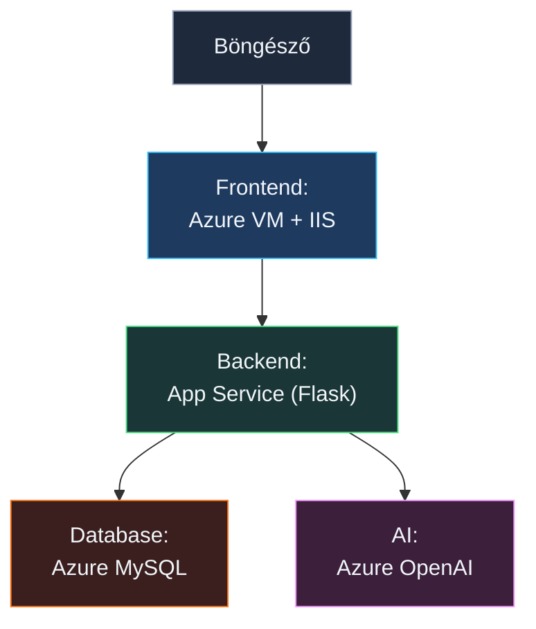

# ☁️ Azure Képzés – Cloud Idézetek + AI Chatbot

Egy napos, gyakorlati Azure képzés. A nap végére egy **működő webalkalmazást** hozunk létre,
ami idézeteket jelenít meg adatbázisból és egy AI chatbotot is tartalmaz.

---

## 🏗️ Architektúra



| Réteg     | Azure szolgáltatás        | Mappa                       |
| --------- | ------------------------- | --------------------------- |
| Frontend  | Azure VM + IIS (Windows)  | `01-Frontend/`              |
| Backend   | App Service (Python)      | `02-Backend/`               |
| Adatbázis | Azure Database for MySQL  | `03-Database/`              |
| AI        | Azure OpenAI / AI Foundry | _(konzolban konfiguráljuk)_ |

---

## 📁 Projekt struktúra

```
.
├── 01-Frontend/
│   ├── index.html
│   ├── css/
│   │   └── style.css
│   └── js/
│       ├── config.js     ← ⚠️ BACKEND_URL beállítás
│       └── app.js
├── 02-Backend/
│   ├── app.py            ← Flask API
│   └── requirements.txt
├── 03-Database/
│   └── init.sql          ← Tábla + idézetek
├── LICENSE
├── README.md             ← Ez a fájl
├── requirements.txt
└── setup-iis.ps1         ← IIS telepítő script
```

---

## 🎯 Haladási terv

| #   | Lépés                                        | Működik utána?            |
| --- | -------------------------------------------- | ------------------------- |
| 1   | Azure VM + IIS + frontend feltöltés          | ❌ (nincs backend URL)    |
| 2   | App Service létrehozása + GitHub deploy      | ❌ (nincs DB, nincs AI)   |
| 3   | config.js frissítése az App Service URL-jére | ❌ (nincs DB)             |
| 4   | Azure MySQL + init.sql + env vars            | ✅ Idézetek működnek!     |
| 5   | Azure OpenAI deployment + env vars           | ✅ AI chatbot is működik! |

---

## Előfeltételek

- Azure előfizetés (ingyenes trial elég)
- GitHub fiók (a backend auto-deployhoz)
- Régió mindenhova: **Sweden Central**
- **DBeaver Community** (adatbázis kezeléshez) – https://dbeaver.io/download/

---

## 1. lépés – Resource Group

Azure Portal → **Resource groups** → **Create**

| Beállítás | Érték            |
| --------- | ---------------- |
| Name      | `workshop-rg`    |
| Region    | `Sweden Central` |

> 💡 Az összes erőforrást ide rakjuk – a végén egyetlen törlésssel mindent eltávolítunk.

---

## 2. lépés – Azure VM + IIS (Frontend)

> 📂 Fájlok: `01-Frontend/`

### 2.1 VM létrehozása

Azure Portal → **Virtual machines** → **Create** → **Azure virtual machine**

| Beállítás      | Érték                                         |
| -------------- | --------------------------------------------- |
| Erőforrás csoport | `workshop-rg`                                 |
| Név           | `frontend-vm`                                 |
| Régió         | `Sweden Central`                              |
| Kép           | **Windows Server 2022 Datacenter**            |
| Méret         | **Standard_B2s**                              |
| Felhasználónév | `rendszergazda`                               |
| Jelszó        | válassz és jegyezd meg!                       |
| Bejövő portok | **HTTP (80), RDP (3389)**                     |
| Nyilvános IP  | **Igen**, hozzunk létre egyet (hálózat fülön) |

### 2.2 Csatlakozás

Azure Portal → VM → **Connect** → **RDP** → letöltöd az RDP fájlt → megnyitod → bejelentkezel.

### 2.3 IIS telepítése + frontend letöltése

A VM-en nyiss egy **PowerShell** ablakot (**Run as Administrator**).

**1. lépés – Töltsd le a setup scriptet:**

```powershell
Invoke-WebRequest "https://raw.githubusercontent.com/cloudsteak/trn-azure-workshop/main/setup-iis.ps1" -OutFile "C:\setup-iis.ps1"
```

**2. lépés – Futtasd:**

```powershell
C:\setup-iis.ps1
```

A script elvégez mindent: telepíti az IIS-t, letölti a frontend fájlokat, és kiírja az elérési URL-t.

> 💡 Ha kézzel szeretnéd elvégezni, itt a tartalom:

```powershell
# IIS telepítése
Install-WindowsFeature -Name Web-Server -IncludeManagementTools

# Régi default oldal törlése
Remove-Item C:\inetpub\wwwroot\iisstart* -Force -ErrorAction SilentlyContinue

# Frontend letöltése GitHub-ról
$repo = "https://raw.githubusercontent.com/cloudsteak/trn-azure-workshop/main/01-Frontend"
$root = "C:\inetpub\wwwroot"

New-Item -ItemType Directory -Force -Path "$root\css", "$root\js" | Out-Null

Invoke-WebRequest "$repo/index.html"    -OutFile "$root\index.html"
Invoke-WebRequest "$repo/css/style.css" -OutFile "$root\css\style.css"
Invoke-WebRequest "$repo/js/config.js"  -OutFile "$root\js\config.js"
Invoke-WebRequest "$repo/js/app.js"     -OutFile "$root\js\app.js"
```

Teszt: `http://<VM_PUBLIC_IP>` → Az oldal megjelenik. A health dashboard piros – ez normális, nincs backend még.

---

## 3. lépés – App Service (Backend)

> 📂 Fájlok: `02-Backend/`

### 3.1 App Service létrehozása

Azure Portal → **App Services** → **Create** → **Web App**

| Beállítás      | Érték                                            |
| -------------- | ------------------------------------------------ |
| Erőforrás csoport | `workshop-rg`                                    |
| Név           | `azure-quotes-api` _(egyedi névnek kell lenni!)_ |
| Publish        | **Code**                                         |
| Runtime        | **Python 3.12**                                  |
| OS             | **Linux**                                        |
| Régió         | `Sweden Central`                                 |
| Plan           | **Free F1**                                      |

### 3.2 Startup parancs beállítása

App Service → **Konfiguráció** → **Verembeállítások** → **Indítási parancs**:

```
gunicorn --bind 0.0.0.0 --timeout 230 app:app
```

→ **Save**

### 3.3 GitHub auto-deploy bekötése

App Service → **Deployment Center**

| Beállítás    | Érték                        |
| ------------ | ---------------------------- |
| Forrás       | **GitHub**                   |
| Szervezet    | a te GitHub felhasználóneved |
| Tároló       | `trn-azure-workshop`         |
| Ág           | `main`                       |

→ **Mentés**

Az Azure automatikusan létrehozza a `.github/workflows/main_azure-quotes-api.yml` fájlt a repóban. Mivel az `app.py` a `02-Backend/` mappában van, a generált fájlban **két sort kell módosítani**:

```yaml
# 1. sor – pip install: cd 02-Backend hozzáadása
- name: Create and Start virtual environment and Install dependencies
  run: |
    cd 02-Backend          # ← ezt a sort add hozzá
    python -m venv antenv
    source antenv/bin/activate
    pip install -r requirements.txt

# 2. sor – artifact path: csak a 02-Backend mappa
- name: Upload artifact for deployment jobs
  uses: actions/upload-artifact@v4
  with:
    name: python-app
    path: |
      02-Backend/          # ← ezt módosítsd (volt: .)
      !02-Backend/antenv/  # ← ezt módosítsd (volt: !antenv/)
```

Minden `main` branchre pusholt változtatás után az App Service automatikusan újra deployol.

### 3.4 ⚠️ Vissza a VM-re: config.js frissítése

Nyisd meg a VM-en: `C:\inetpub\wwwroot\js\config.js` (Notepad vagy VS Code)

Cseréld ki az `XXXXXXXXXX`-et:

```javascript
const CONFIG = {
  BACKEND_URL: "https://azure-quotes-api.azurewebsites.net",
};
```

> Az App Service URL-t megtalálod: Azure Portal → App Service → **Overview** → **Default domain**

---

## 4. lépés – Azure Database for MySQL

> 📂 Fájlok: `03-Database/`

### 4.1 MySQL Flexible Server létrehozása

Azure Portal → **Azure Database for MySQL Flexible Servers** → **Create**

| Beállítás      | Érték                   |
| -------------- | ----------------------- |
| Resource group | `workshop-rg`           |
| Server name    | `quotes-db` _(egyedi!)_ |
| Region         | `Sweden Central`        |
| MySQL version  | `8.0`                   |
| Workload type  | **Development**         |
| Admin username | `adminuser`             |
| Password       | válassz és jegyezd meg! |

**Networking tab:**

- Connectivity method: **Public access**
- ✅ Add current client IP address

→ **Review + create** → Várj ~3 percet.

### 4.2 Firewall – App Service hozzáférés

MySQL Flexible Server → **Networking** → **Firewall rules** → **Add**:

| Name        | Start IP  | End IP            |
| ----------- | --------- | ----------------- |
| `allow-all` | `0.0.0.0` | `255.255.255.255` |

> ⚠️ Workshop után szűkítsd le!

### 4.3 Csatlakozás DBeaver-rel

DBeaver → **New Database Connection** → **MySQL**

| Mező     | Érték                                |
| -------- | ------------------------------------ |
| Host     | `quotes-db.mysql.database.azure.com` |
| Port     | `3306`                               |
| Database | `cloudquotes`                        |
| Username | `adminuser`                          |
| Password | a te jelszavad                       |

SSL tab: **Use SSL** ✅

→ **Test Connection** → **Finish**

### 4.4 SQL futtatása DBeaver-ben

1. Bal oldali fa → `cloudquotes` → jobb klikk → **SQL Editor** → **Open SQL Script**
2. Nyisd meg a `03-Database/init.sql` fájlt (File → Open File, vagy másold be a tartalmát)
3. **Fontos**: az editor tetején ellenőrizd, hogy a `cloudquotes` adatbázis van kiválasztva!
4. **Execute** (▶️ gomb vagy Ctrl+Enter) – az összes parancs lefut
5. Ellenőrzés: a Results panelen látod a kategóriánkénti darabszámot

### 4.5 ⚠️ App Service: environment variables beállítása

App Service → **Configuration** → **Environment variables** → **+ Add**

Add hozzá egyenként az alábbi változókat:

| Name          | Value                                |
| ------------- | ------------------------------------ |
| `DB_HOST`     | `quotes-db.mysql.database.azure.com` |
| `DB_PORT`     | `3306`                               |
| `DB_USER`     | `adminuser`                          |
| `DB_PASSWORD` | a te jelszavad                       |
| `DB_NAME`     | `cloudquotes`                        |

Minden sor után **+ Add**, majd az összes hozzáadása után → **Apply** → **Confirm** → **Save**

> ⚠️ A Save után az App Service automatikusan újraindul.

### 4.6 Tesztelés

Nyisd meg a webapp-ot: `http://<VM_PUBLIC_IP>`

🎉 **Az idézetek megjelennek!** A health dashboard-on az App Service és a MySQL zöldre vált.

---

## 5. lépés – AI Chatbot (Azure OpenAI)

> _(Nincs kódfájl – a backend kód a 3. lépésben már felkerült)_

### 5.1 OpenAI erőforrás létrehozása

Azure Portal → **Azure OpenAI** → **Create**

| Beállítás      | Érték                                                 |
| -------------- | ----------------------------------------------------- |
| Resource group | `workshop-rg`                                         |
| Name           | `quotes-openai`                                       |
| Region         | **Sweden Central** _(itt érhető el a legtöbb modell)_ |
| Pricing tier   | Standard S0                                           |

### 5.2 Modell deployment (Azure AI Foundry)

OpenAI erőforrás → **Go to Azure AI Foundry** → **Deployments** → **Deploy model**

| Beállítás       | Érték         |
| --------------- | ------------- |
| Model           | `gpt-4o-mini` |
| Deployment name | `gpt-4o-mini` |

### 5.3 API Key és Endpoint lekérése

Azure Portal → OpenAI erőforrás → **Keys and Endpoint**

- **Endpoint**: `https://quotes-openai.openai.azure.com/`
- **Key 1**: `xxxxxxxx…`

### 5.4 ⚠️ App Service: OpenAI environment variables

App Service → **Configuration** → **Environment variables** → **+ Add**

| Name                | Value                                     |
| ------------------- | ----------------------------------------- |
| `OPENAI_ENDPOINT`   | `https://quotes-openai.openai.azure.com/` |
| `OPENAI_KEY`        | az API kulcs                              |
| `OPENAI_DEPLOYMENT` | `gpt-4o-mini`                             |

Minden sor után **+ Add**, majd → **Apply** → **Confirm** → **Save**

> ⚠️ A Save után az App Service automatikusan újraindul.

### 5.5 Tesztelés

Nyisd meg a webapp-ot: `http://<VM_PUBLIC_IP>` → 🤖 → kérdezz valamit!

🎉 **Az AI válaszol!** A health dashboard-on az OpenAI is zöldre vált.

> 💡 **Megjegyzés**: A chatbotnak nincs memóriája – minden üzenet független kérés az OpenAI felé.
> Memóriát (konverzáció-előzmények) Azure Cosmos DB-vel lehetne implementálni, de a cél most az volt,
> hogy lássuk milyen **egyszerű egy AI chatbotot összerakni** Azure-on.

---

## 🎉 Kész!

A teljes alkalmazás működik:

```
Idézetek:  Böngésző → VM IIS → App Service → Azure MySQL
AI Chat:   Böngésző → VM IIS → App Service → Azure OpenAI
```

---

## Takarítás (Erőforrások eltávolítása a képzés után!)

Azure Portal → **Resource groups** → `workshop-rg` → **Delete resource group** → gépeld be: `workshop-rg` → **Delete**

Minden törlődik egyszerre.

---

## ❓ Gyakori problémák

| Probléma                 | Megoldás                                                               |
| ------------------------ | ---------------------------------------------------------------------- |
| App Service 500 hiba     | App Service → **Log stream** – ott látod a Python hibát                |
| MySQL connection refused | Firewall rule hozzáadva? App Service újraindult a Save után?           |
| CORS hiba böngészőben    | `flask-cors` telepítve? App Service újraindult?                        |
| OpenAI 404               | A deployment neve pontosan egyezik az `OPENAI_DEPLOYMENT` env var-ral? |
| OpenAI auth error        | Trailing slash az endpoint URL végén! (`…azure.com/`)                  |
| Frontend nem frissül     | `Ctrl+Shift+R` hard reload a böngészőben                               |
| GitHub deploy nem fut    | Repo → Actions → nézd meg a workflow log-ot                            |
| IIS nem indul            | PowerShell → `Get-Service W3SVC`                                       |

---

## 💰 Költségek

| Szolgáltatás               | Free tier      | Becsült költség |
| -------------------------- | -------------- | --------------- |
| VM Standard_B2s            | ❌             | ~$0.05/nap      |
| App Service Free F1        | ✅             | $0              |
| Azure MySQL Burstable B1ms | ❌             | ~$0.02/nap      |
| Azure OpenAI GPT-4o-mini   | ❌ Pay-per-use | ~$0.01–0.05/nap |
